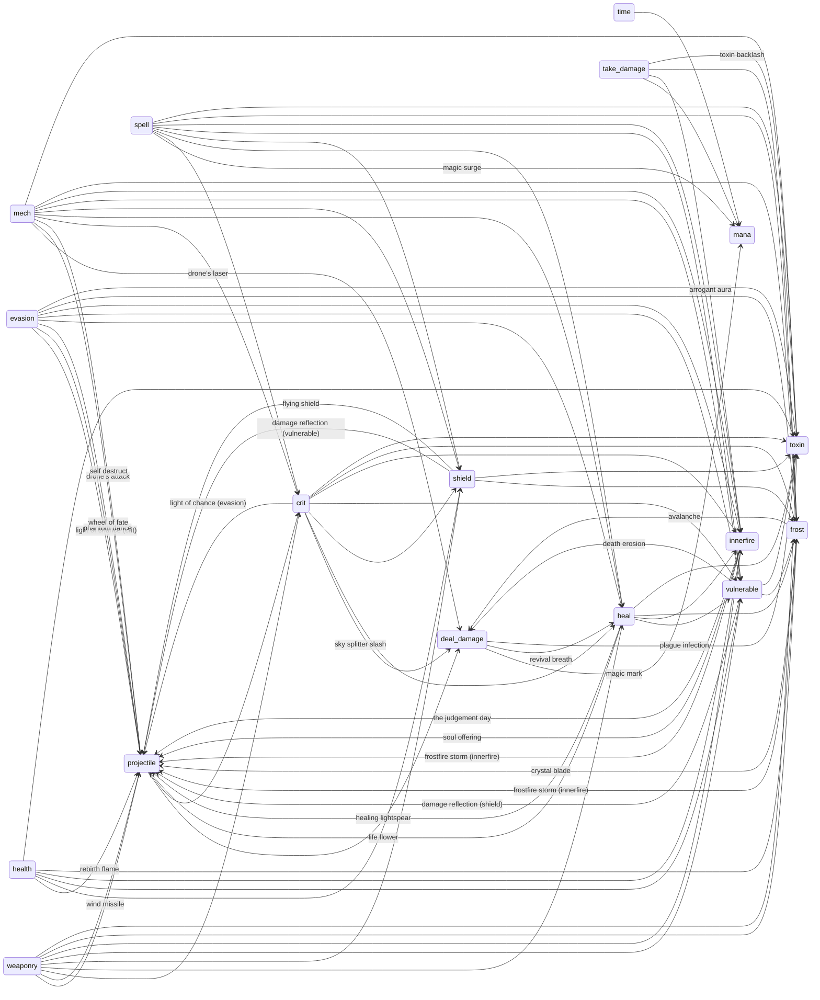

```mermaid
stateDiagram
direction LR

time --> mana
projectile --> deal_damage
projectile --> crit

weaponry --> projectile
weaponry --> projectile: wind missile
weaponry --> crit
weaponry --> heal
weaponry --> shield
weaponry --> vulnerable
weaponry --> innerfire
weaponry --> frost
weaponry --> toxin

take_damage --> mana
deal_damage --> mana: magic mark
spell --> mana: magic surge
spell --> crit
spell --> heal
spell --> shield
spell --> vulnerable
spell --> innerfire
spell --> frost
spell --> toxin

crit --> projectile: light of chance (evasion)
crit --> deal_damage: sky splitter slash
crit --> heal
crit --> shield
crit --> vulnerable
crit --> innerfire
crit --> frost
crit --> toxin

evasion --> projectile: light of chance (crit)
evasion --> projectile: phantom dance
evasion --> projectile: wheel of fate
evasion --> heal
evasion --> vulnerable
evasion --> innerfire
evasion --> frost
evasion --> toxin

health --> projectile: rebirth flame
health --> shield
health --> vulnerable
health --> innerfire
health --> frost
health --> toxin

mech --> deal_damage: drone's laser
mech --> projectile: drone's attack
mech --> projectile: self destruct
mech --> crit
mech --> heal
mech --> shield
mech --> vulnerable
mech --> innerfire
mech --> frost
mech --> toxin

deal_damage --> heal: revival breath
heal --> projectile: life flower
heal --> projectile: healing lightspear
heal --> vulnerable
heal --> innerfire
heal --> frost
heal --> toxin

shield --> projectile: damage reflection (vulnerable)
shield --> projectile: flying shield
shield --> frost
shield --> toxin

vulnerable --> deal_damage: death erosion
vulnerable --> projectile: damage reflection (shield)
vulnerable --> frost
vulnerable --> toxin

take_damage --> innerfire: arrogant aura
innerfire --> projectile: frostfire storm (innerfire)
innerfire --> projectile: soul offering
innerfire --> projectile: the judgement day

take_damage --> frost
frost --> deal_damage: avalanche
frost --> projectile: frostfire storm (innerfire)
frost --> projectile: crystal blade

take_damage --> toxin: toxin backlash
deal_damage --> toxin: plague infection
```
